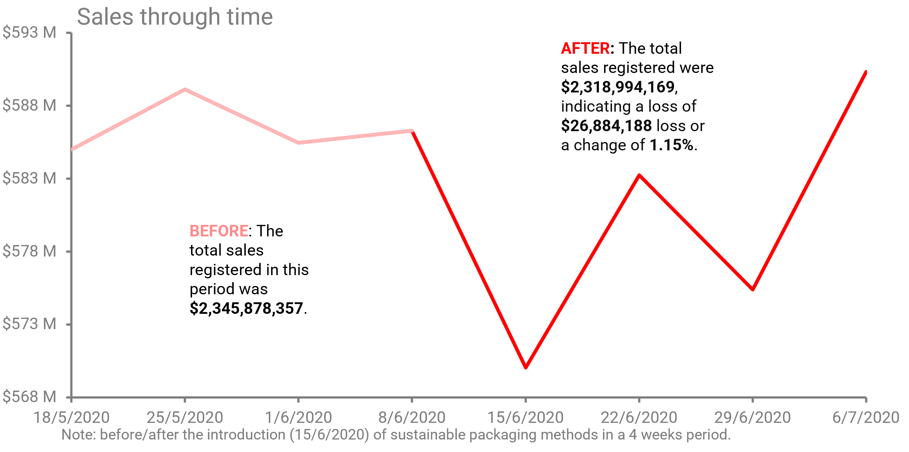
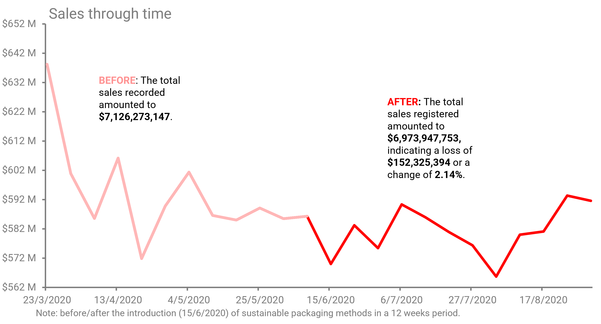
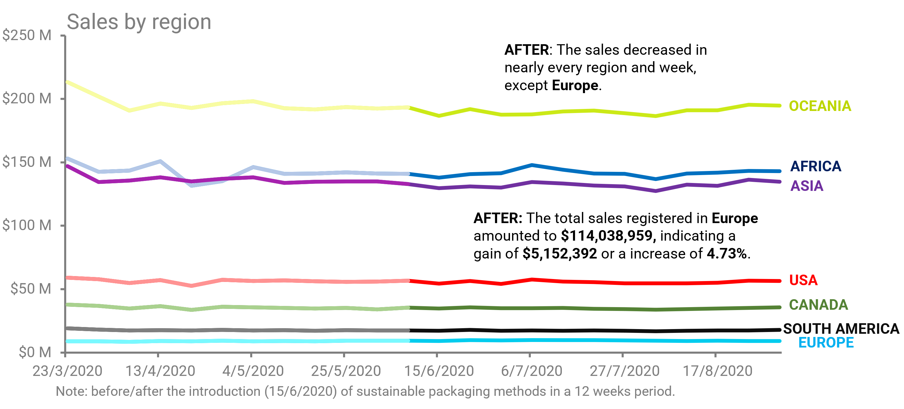
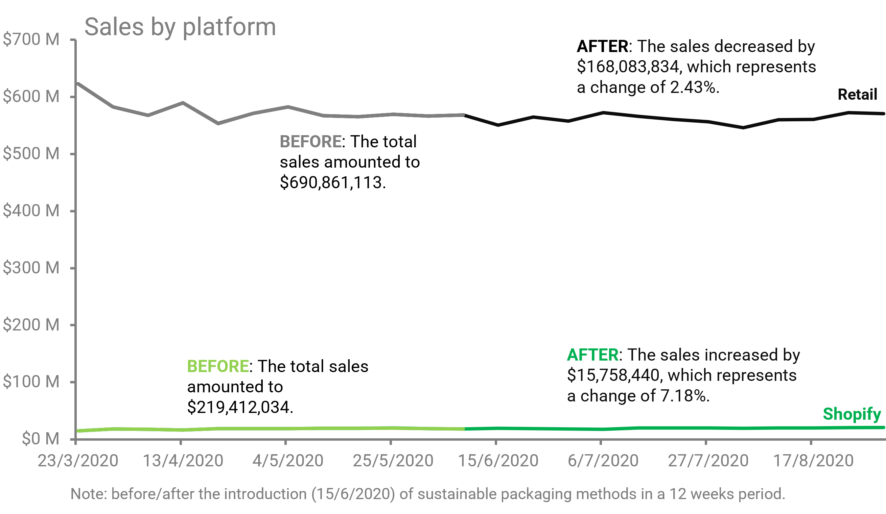
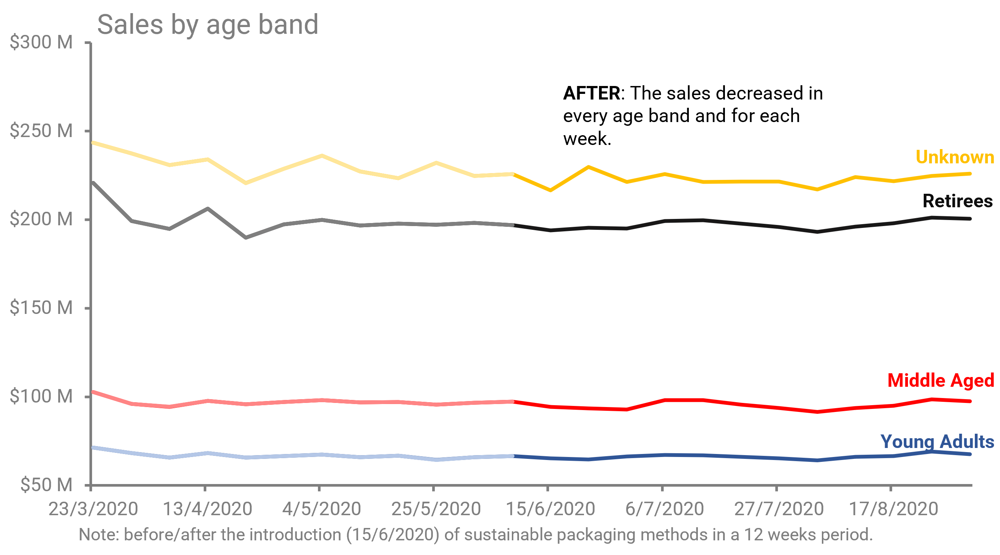
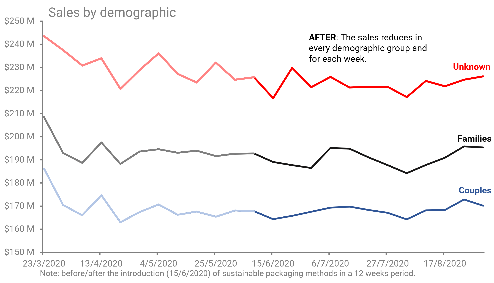
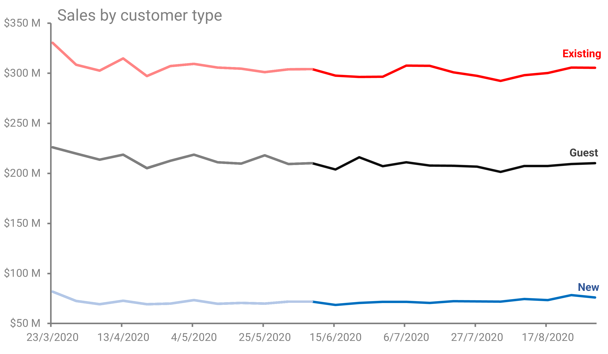

# Descriptive and prescriptive analysis for Data mart

## Project background

Data mart is Danny’s latest venture that runs international operations for his online supermarket that specializes in fresh products.

In June 2020 - large-scale supply changes were made at the Data mart. All Data mart products now use sustainable packaging methods in every single step, starting from farm to customer. Danny needs your help to quantify the impact of this change on the sales performance of Data mart and its separate business areas.

The analysis produces insights and recommendations in the following areas:

- Before & after analysis: Provide metrics for the impact on sales performance before/after the introduction of sustainable packaging methods. The results cover the impact at a global level and different business areas.

The data was synthetically generated [here](https://8weeksqlchallenge.com/case-study-5/).  

## Data structure and initial checks

The provided dataset has 17,117 observations, each representing the sales for every region at a weekly level. It contains 7 columns that includes data about:

| Column        | Purpose                                                  |
|---------------|----------------------------------------------------------|
| week_date     | Date of the week for which the data is recorded         |
| region        | Geographical region where the transactions occurred      |
| platform      | Platform used for the transactions (e.g., Retail, Shopify) |
| segment       | Segment of customers or products                         |
| customer_type | Type of customer (e.g., New, Existing, Guest)            |
| transactions  | Number of transactions made                               |
| sales         | Total sales value|

## Executive summary

### Overview of findings

Data mart's sales performance declined compared to previous time periods (4 and 8 weeks) after the introduction of 
sustainable packaging methods. The same trend repeats in nearly every business area. The following sections will provide a 
detailed exploration of these results.

### Before/after analysis

#### Sales performance (4 week period)

The sales registered before the introduction of sustainable packaging methods totaled $2,345,878,357. In contrast, the post-introduction period sales amounted to $2,318,994,169, indicating a loss of $26,884,188 or a change of 1.15%.

#### Sales performance (12 week period)

The sales registered before the introduction of sustainable packaging methods totaled $7,126,273,147. In contrast, the post-introduction period sales decreased to $6,973,947,753, indicating a loss of $152,325,394, or a decline of 2.14%. Notably, this trend appears to be doubling over time.

#### Sales performance by region (12 week period)

Sales declined in nearly every region, except for Europe, following the introduction of sustainable packaging methods. Total sales, not counting Europe, were $6,859,908,794. The decline ranged from 0.54% to 3.03%, representing a loss of $157,477,786. In contrast, Europe's sales amounted to $114,038,959, representing a 4.73% increase, equal to an additional $5,152,392.

#### Sales performance by platform (12 week period)

Sales declined on the retail platform, while the Shopify platform experienced the opposite trend, following the introduction of sustainable packaging methods. Total retail sales amounted to $6,738,777,279, reflecting a decline of 2.43%, a loss of $168,083,834. In contrast, Shopify generated sales of $235,170,474, marking a 7.18% increase, equivalent to an additional $15,758,440.

#### Sales performance by age band (12 week period)

Sales declined in every age band, ranging from 0.92% to 3.34%, representing a loss of $152,325,394. The age band with unknown identity registered sales of $2,671,961,443, and experienced the biggest decline, losing $92,393,021, or 3.34%.

#### Sales performance by demographic (12 week period)

Sales declined in every demographic, ranging from 0.87% to 3.34%, representing a loss of $152,325,394. The demographic with unknown identity registered sales of $2,671,961,443, and experienced the biggest decline, losing $92,393,021, or 3.34%.

#### Sales performance by customer type (12 week period)

Sales declined across nearly customer categories, except for new customers. Total sales, not counting new customers, were $6,102,477,089. The decline in sales ranged from 2.27% to 3%, representing a loss of $161,075,639. In contrast, new customer sales amounted to $871,470,664, representing a 1.01% increase, equal to an additional $8,750,245.

